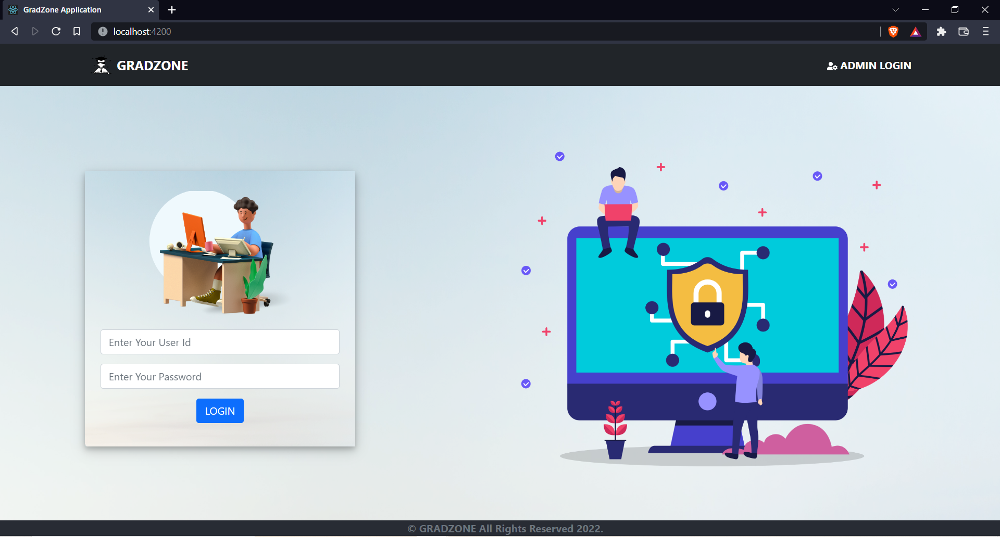
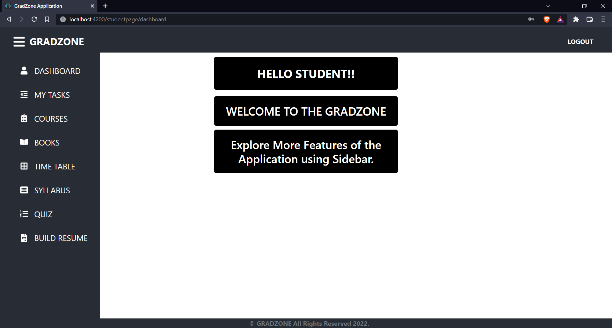
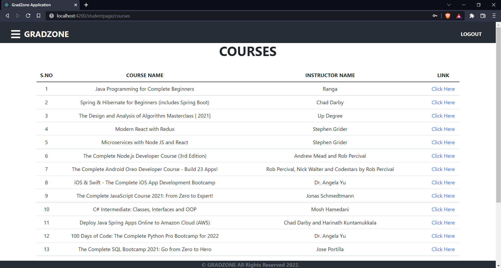
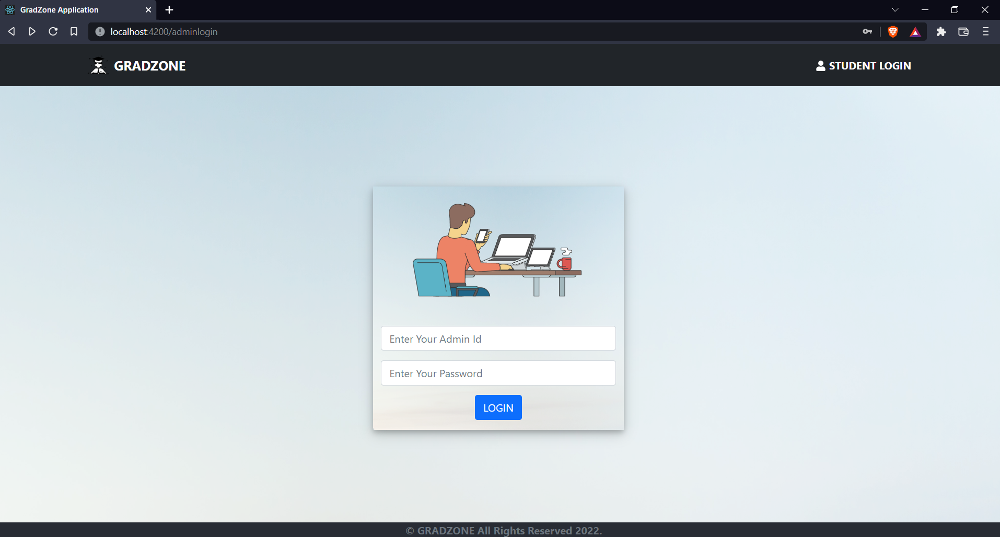
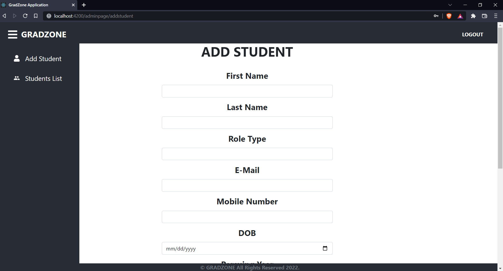

# GradZone
<b>GRADZONE is a kind of Enterprise Resource Planning System for students of the CSE Branch. It is a web application that is built using ReactJs frontend and SpringBoot backend. GRADZONE has tried to simplify things as simple as possible for the user as it was using the latest technologies which are very user friendly as the UI is made in ReactJs which makes the application very easy to use and switch between the different components of the web page without refreshing the entire page information and the backend is written in java which uses the concept of restful services which are only invoked only when they are called from the frontend and then fetch the required data from the MySQL database.
<b>
# Here are the some snapshots of the GradZone working:-

